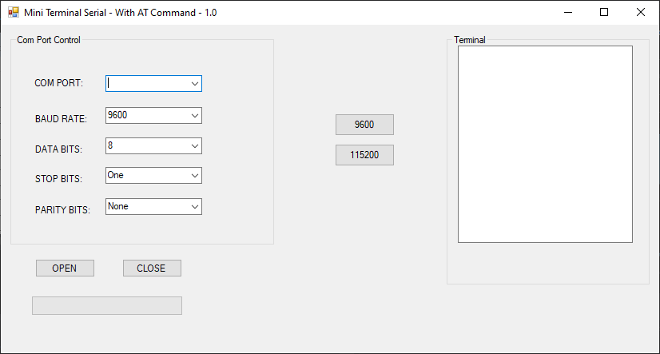

# Mini Terminal Serial with AT Commands

## Overview
This project is a **Windows Forms C# application** for sending and receiving **AT commands** via a serial port. It provides a graphical user interface (GUI) to communicate with serial devices such as modems, microcontrollers, and IoT devices.

## Features
- **Detect Available COM Ports**: Lists all detected serial ports on the system.
- **Baud Rate Configuration**: Supports **115200** and **9600** baud rates.
- **Send AT Commands**: Allows users to send AT commands to the connected device.
- **Receive Serial Data**: Displays responses received from the serial device.

---

## Prerequisites
### Software Requirements
- Windows OS (Tested on Windows 10/11)
- .NET Framework 4.7 or higher
- Visual Studio (for modifications & debugging)

### Hardware Requirements
- A serial device (e.g., GSM module, microcontroller with UART)
- USB-to-Serial adapter (if required)

---

## Setup & Installation
### 1. Running the Application
- Download the latest **`Serial_Catur1.0.exe`** from the `bin/Debug/` folder.
- Connect your serial device to the computer.
- Launch the application by double-clicking `Serial_Catur1.0.exe`.

### 2. Running from Source Code
To modify or compile the application:
- Open `Serial_Catur1.0.sln` in **Visual Studio**.
- Restore NuGet packages if required.
- Compile and run the project.

---

## How to Use
### 1. Select COM Port
- Open the application.
- Choose an available COM port from the dropdown.

### 2. Configure Baud Rate
- Select **115200** or **9600** baud rate (default is 115200).

### 3. Send AT Commands
- Type an AT command in the input box.
- Press **Send** to transmit it to the connected device.
- Responses from the device will be displayed in the output area.

### 4. Example AT Commands
| Command | Description |
|---------|-------------|
| `AT` | Check if the module is responding |
| `AT+IPR=115200` | Set baud rate to 115200 |
| `AT+GMI` | Get device manufacturer |
| `AT+GMM` | Get device model |
| `AT+CSQ` | Check signal quality |

---

## Screenshot
To visualize the GUI interface, see the screenshot below:

---

## Troubleshooting
### 1. Serial Port Not Detected
- Ensure the device is properly connected.
- Check the **Device Manager** in Windows for available COM ports.
- Try a different USB port or cable.

### 2. No Response from Device
- Verify the correct baud rate is selected.
- Check if another application is using the serial port.
- Restart the application and reconnect the device.

---

## Automation
This application can be extended to:
- Log serial communication data.
- Automate device configuration via batch AT commands.
- Integrate with IoT and embedded systems for remote control.

---
